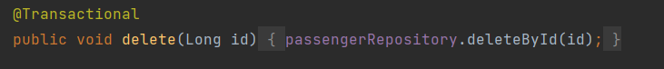

# Проект титаник
## Используемые технологии
* Java 17, Stream API
* Maven
* Spring Boot  3, Spring JPA
* PostgreSQL 12, Liquibase
* REStful
* HTML 5(Thymeleaf) 
### Структура проекта

### Основная информация
# Первый запуск
В p4admin у владельца ссоздайте базу данный titanic

Удедитесь что владелец и пароль совпадают

Можете запускать проект
# Внимание!!! при первом запуске будет происходить парсинг файла с данными и сохранение в таблицу(во избежании дублирования данных закоментрийте после первого запуска аннотацию PostConstruct в пакете Util в класс ParserCsv)
Данный класс парсит файл по ссылке fileName в сущность Passenger(и сохраняет в базу данных) 

# Model

Содержит в себе сущность пассажира

Параметры
* Id(автогеннерация) тип Long
* survived - статус выжившего( true-выжил,false-погиб) тип Boolean
* name - имя (Имя не может быть пустым, должно содержать от 2х до 100 символов) тип String
* sex -пол (пол не может быть пустым, male-мужчина female-женщина) тип String 
* age -врзраст(Врзраст не может быть пустым , не может быть меньще 0) тип int
* countSiblingsOrSpousesOnBoard - количество Братьев, Сестер Или Супругов На Борту (не может быть пустым , не может быть меньще 0) тип int
* countParentsOrChildrenOnBoard -  количество Родителей Или Детей На Борту(не может быть пустым , не может быть меньще 0) тип int
* fare-стоимость билета (Стоимость билета не может быть пустым , не может быть меньще 0) тип Double

# Repository

Стандартный класс репозитория для взаимодействия с базой данных 

Имеет один дополнительный метод
findByName - принимает на вход имя , возвращает лист пассажиров с этим именем 

# Service

Содержит в себе всю бизнес-логику

Для упрощения тестирования реализованны CRUD - операции

Методы CRUD:

* findAll (врзвращает всез пассажиров)

* findById (принимает id возвращает пассажира с этим id)

* save (слхранение пассажира в базу данных)

* update (принимает id и нового пассажира, изменяет пассажира с id на переданного пассажира)

* delete(принимает id и удаляет пассажира с этим id)
* 

Методы реализующие функциональность:
* limit метод для выдачи определенного количества пассажиров(на вход приходит чисто пассажиров,вохвращает лист пассажиров) 

*sortAndLimit -  метод для сортировки с лимитом( на вход получает параметр по которому пролисходит сортировка, тип сортировки(по возрастания или убыванию) и лимит,возвращает отсортированный лист пассажиров)
  
* sort - метод для сортировки (принимает значение по какому полю будет происходить сортировка, а так же тип сортировки ascending -по возрастанию , descending-по убыванию)

тип сортировки

Параметры по которым может производится сортировка(id,name,a  ge,fare) для увеличения функциональности можно раскоментирование блок кода(тогда можно будет производить сортировку по любому полю)

* pagination метод реализующий пагинацию по трем полям page,size и sort так же сортировать можно по возрастанию и убыванию

* pageAndSize метод реализующий пагинацию по двум полям page,size

* search - осуществляет поиск пассажира по имени(принимает имя - возвращает лист пассажиров с совпавшим именем)

* getFareSum() - возвращает суммы всех билитов(фильтрует по полю fare и считает сумму)
* 
* - passengerHadRelativesOnBoard() - возвращает количество всех пассажиров у кого есть родственники на борту(проверяет если getCountParentsOrChildrenOnBoard()   ,getCountSiblingsOrSpousesOnBoard()  не равны 0 => следовательно есть родственники на борту)

- * getCounterOfSurvivors() - возвращает количество выживших пассажиров(параметр survivors==true)
* 
* getPassengersSurvivors() - возвращает лист всех выживших пассажиров(параметр survivors==true)

* getAnAdultPassenger() - возвращает лист всех совершенолетних пассажиров(age>16)

* getPassengersSexMale()-возвращает всех пассажиров мужского пола

* getNoPassengerHadRelativesOnBoardList() -возвращает всех пассажиров у кого нет родственников на борту (проверяет если getCountParentsOrChildrenOnBoard()   ,getCountSiblingsOrSpousesOnBoard()   равны 0 => следовательно нет родственники на борту)

# Пользователь имеет возможность создавать свой собственный фильтр пассажииров (фильтр по одному , двум , трем , или 4 параметрам)
* filter на вход получает лист пассажиров которых нужно отфильтровать и тип фильстрации , возвращает отфильтрованный лист по определенному типу фильтрации

* Параметры фильтрации (для расширения возможностей фильтра добавить в лист нужный фильтр и реализовать if в методе filter) 

* filter - фильтрацию можно производить одновременно по одному, двум , трем и 4-м параметрам(более подродно описанно в разделе пользовательских возможностей) 
* 
#Controller
В контроллер делится на пользовательский (методы возвращающие представлени) и REST методы возвращающие JSON(для целей тестирования и реализации CRUD) - на них можно не обращать внимание
# Возможные url
* http://localhost:8080/passengers - переход на стартофую страницу

# В левом углу можно увидеть 5 кнопок при нажатии вы перейдете на соответсвующие страницы:
# Первая кнопка (переход на страницу со всеми выжившими пассажирами внизу страницы ссылка для возвращения на стартовую страницу) 
* http://localhost:8080/passengers/survivors

# Вторая кнопка (переход на страницу со всеми совершенолетними пассажирами внизу страницы ссылка для возвращения на стартовую страницу)
* http://localhost:8080/passengers/age

# Третья кнопка (переход на страницу со всеми пассажирами мужского пола внизу страницы ссылка для возвращения на стартовую страницу)
* http://localhost:8080/passengers/sex

# Четвертая кнопка (переход на страницу со всеми пассажирами  у которых нет родственников на борту внизу страницы ссылка для возвращения на стартовую страницу)
*http://localhost:8080/passengers/NoParentsToBoard

# Пятая кнопка (переход на страницу на которой можно создать свой собственный фильтр пассажиров  внизу ссылка для возвращения на стартовую страницу)
*http://localhost:8080/passengers/filterForms
На скриншоте видна что сделать фильтр можно с одним с двумя тремя и четырьмя параметрами

После выбора параметров при нажатии на кнопку "Отсортировать!" попадаем на страницу с отсортированным списком(внизу две ссылки на страницу создания фильтра и на стартовую)

# На стартовой странице в центре рпредставленно форма для пассажира по имени
Формат имени Mr. William Henry Allen
*http://localhost:8080/passengers/search?name=Mr.+William+Henry+Allen

# На стартовой странице внизу так же представленны следущиие функции:
* Указание лимита(Выдача нужного количества пассажиров)(от 1 до 888)
* http://localhost:8080/passengers/limit?limit=50

* Сортировка( по возврастанию и убыванию по параметрам (id,fare,name,age))
для увеличения числа параметров сортировки в классе PassengerService в статическом методе расскоментируйте нужные параметры
* http://localhost:8080/passengers/sort?type=DESCENDING&sort=fare

* Сортировка с лимитом( по возврастанию и убыванию по параметрам (id,fare,name,age) и лимит на выдачу числа пассажиров)
*http://localhost:8080/passengers/sortAndLimit?type=DESCENDING&sort=fare&limit=50

* Пагмнация по двум параметрам(page,size)
* http://localhost:8080/passengers/sortAndLimit?type=DESCENDING&sort=fare&limit=50

* Пагмнация c тремя параметрам(page,size,sort(с указанием типа сортировки и параметра сортировки))
* http://localhost:8080/passengers/pagination?page=15&size=15&type=DESCENDING&sort=fare

* В конце каждой страницы приведенны статистические данные
